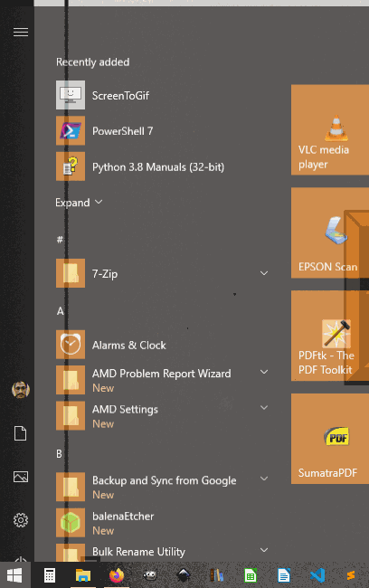
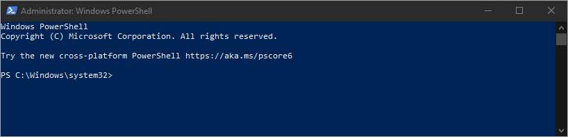
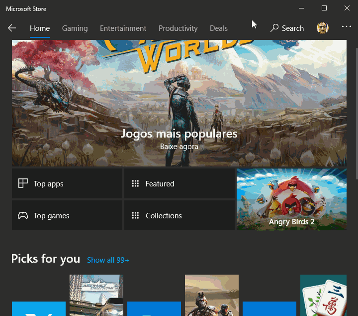
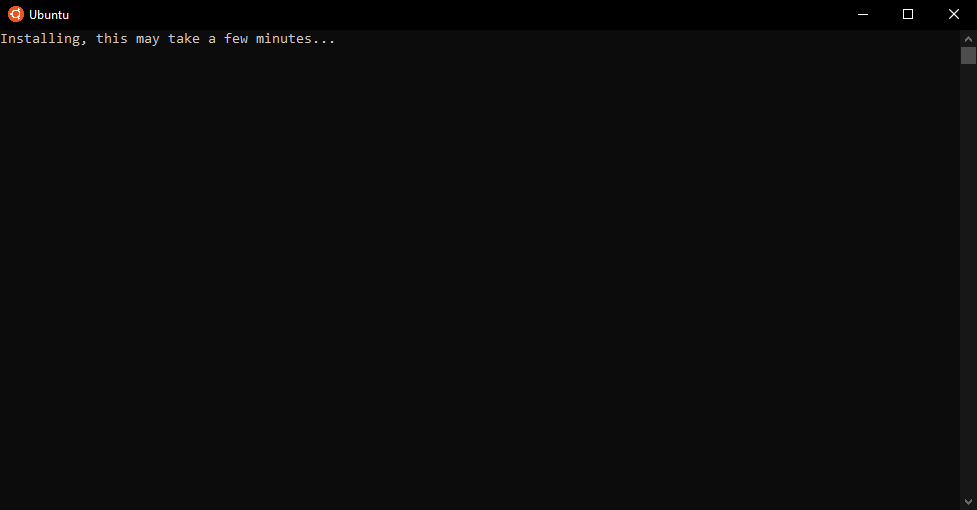
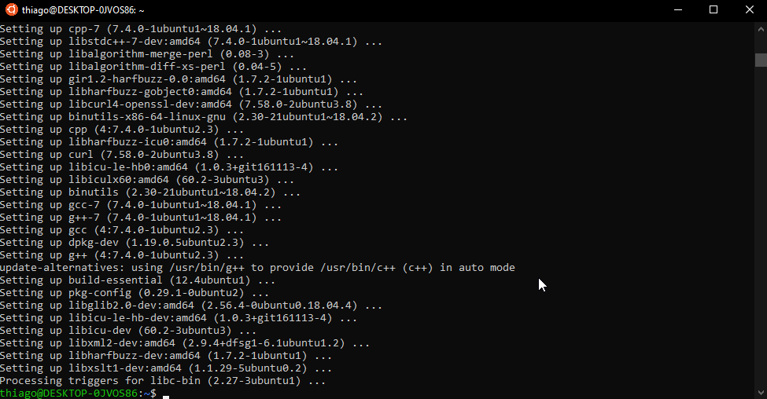
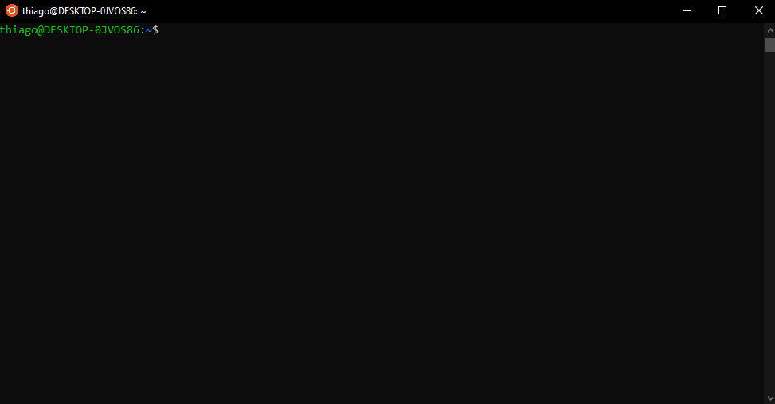
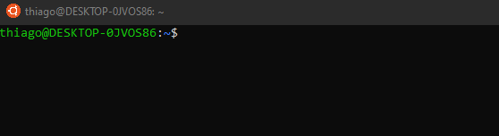
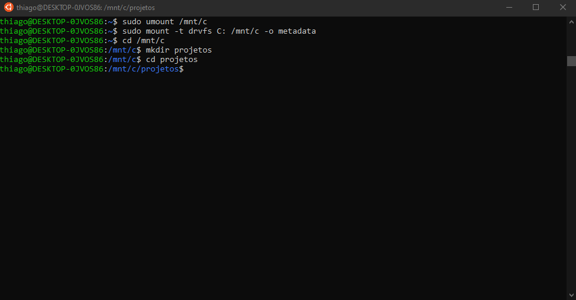
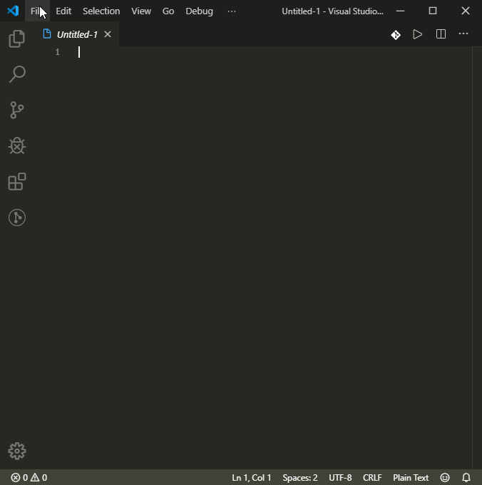
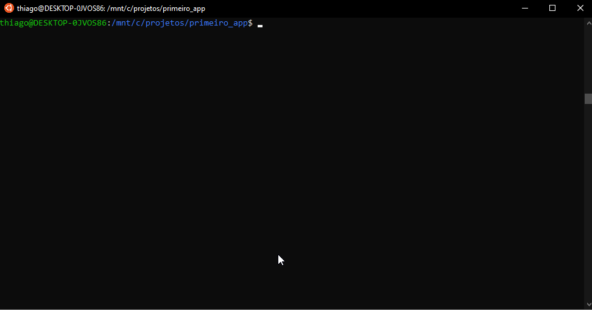

# Como instalar o Rails no Windows 10 / Ubuntu

- [Instalando o editor de texto](#instalando-o-editor-de-texto)
- [Instalando o terminal do Ubuntu no Windows 10 (Fonte: It's FOSS)](#instalando-o-terminal-do-ubuntu-no-windows-10-fonte-its-foss)
- [Instalando todos os programas necessários](#instalando-todos-os-programas-necess%c3%a1rios)
- [Criando a pasta de projetos](#criando-a-pasta-de-projetos)
  - [Ubuntu no Windows 10](#ubuntu-no-windows-10)
  - [Ubuntu](#ubuntu)
- [Criando um novo projeto no Rails](#criando-um-novo-projeto-no-rails)
  - [Ubuntu no Windows 10](#ubuntu-no-windows-10-1)
  - [Ubuntu](#ubuntu-1)
- [Atualizando o Gemfile](#atualizando-o-gemfile)
  - [Ubuntu no Windows 10](#ubuntu-no-windows-10-2)
  - [Ubuntu](#ubuntu-2)

## Instalando o editor de texto

Recomendado: **Visual Studio Code**

[Link para o site oficial](https://code.visualstudio.com/)

## Instalando o terminal do Ubuntu no Windows 10 ([Fonte: It's FOSS](https://itsfoss.com/install-bash-on-windows/))

Se você está rodando o Ubuntu instalado no seu computador ou em uma máquina virtual, **pule para a [próxima etapa](#instalando-todos-os-programas-necess%c3%a1rios)**.

1. Execute o **Windows PowerShell** como administrador.



2. Habilite o **Windows Subsystem for Linux (WSL)** digitando o comando abaixo no terminal e apertando <kbd>Enter</kbd>.

```powershell
Enable-WindowsOptionalFeature -Online -FeatureName Microsoft-Windows-Subsystem-Linux
```


3. Aperte <kbd>Y</kbd> e <kbd>Enter</kbd> para reiniciar o computador e continuar o procedimento (é *necessário* reiniciar).
4. Abra a **loja da Microsoft**.


5. Procure por **linux**, abra o primeiro resultado e instale o app **Ubuntu**.



6. **Abra** o Ubuntu, **aguarde** a instalação e **configure** seu usuário e senha.



<!--
## Instalando o Ruby no Ubuntu com o rbenv ([Fonte: GoRails](https://gorails.com/setup/windows/10))

1. **Atualize o sistema** com o comando abaixo (pode demorar alguns minutos)

```shell
sudo apt-get update
```

2. Instale as **dependências do Ruby** com o comando abaixo (pode demorar vários minutos)

```shell
sudo apt-get install git-core curl zlib1g-dev build-essential libssl-dev libreadline-dev libyaml-dev libsqlite3-dev sqlite3 libxml2-dev libxslt1-dev libcurl4-openssl-dev software-properties-common libffi-dev
```


3. Instale o **rbenv** com os comandos abaixo (atenção: execute **um comando de cada vez**, apertando <kbd>Enter</kbd>)

```shell
cd
git clone https://github.com/rbenv/rbenv.git ~/.rbenv
echo 'export PATH="$HOME/.rbenv/bin:$PATH"' >> ~/.bashrc
echo 'eval "$(rbenv init -)"' >> ~/.bashrc
exec $SHELL

git clone https://github.com/rbenv/ruby-build.git ~/.rbenv/plugins/ruby-build
echo 'export PATH="$HOME/.rbenv/plugins/ruby-build/bin:$PATH"' >> ~/.bashrc
exec $SHELL
```

4. Instale o **Ruby** com os comandos abaixo (pode demorar **vários** minutos)

```shell
rbenv install 2.6.3
rbenv global 2.6.3
```

5. Verifique que a instalação foi bem sucedida imprimindo a versão do **Ruby** na tela

```shell
ruby -v
```

6. Instale o **bundler** com os comandos abaixo

```shell
gem install bundler
rbenv rehash
```



## Instalando o Rails

1. Instale o **NodeJS** com os comandos abaixo

```shell
curl -sL https://deb.nodesource.com/setup_13.x | sudo -E bash -
sudo apt-get install -y nodejs
```

2. **Desabilite o download da documentação** de gems com o comando abaixo

```shell
echo "gem: --no-document" >> ~/.gemrc
```

3. Instale o **Rails** com os comandos abaixo (pode demorar **vários** minutos)

```shell
gem install rails -v 6.0.0
rbenv rehash

# Checando a versão para saber se a instalação deu certo
rails -v
```

4. Instale o **Yarn** com os comandos abaixo

```shell
curl -sS https://dl.yarnpkg.com/debian/pubkey.gpg | sudo apt-key add -
echo "deb https://dl.yarnpkg.com/debian/ stable main" | sudo tee /etc/apt/sources.list.d/yarn.list
sudo apt update && sudo apt install yarn
alias node=nodejs
```


## Instalando a interface de linha de comando do Heroku

Execute o comando abaixo

```shell
curl https://cli-assets.heroku.com/install-ubuntu.sh | sh
```


-->

## Instalando todos os programas necessários

É possível instalar todos os programas necessários utilizando o comando abaixo

```shell
curl https://raw.githubusercontent.com/theagoliveira/sisb031_20192/master/tutoriais/instalacao_rails.sh | bash -i
```

O comando faz o download e executa um script que instala todas as ferramentas necessárias para criar um projeto Rails:

- Dependências do Ruby
- rbenv
- Ruby
- Bundler
- NodeJS
- Rails
- Yarn
- Heroku

**:warning: :warning: :warning: IMPORTANTE: deve-se observar a instalação dos programas até o final, pois será necessário colocar a senha de usuário algumas vezes durante o procedimento**

## Criando a pasta de projetos

### Ubuntu no Windows 10

Usuários no Windows 10 devem criar sua pasta no disco do Windows, fora do sistema de arquivos do Ubuntu, para que o editor de texto possa acessá-los. Utilize o comando abaixo para criar sua pasta de projetos

```shell
eval "$(curl https://raw.githubusercontent.com/theagoliveira/sisb031_20192/master/tutoriais/criar_pasta_windows.sh)"
```

### Ubuntu

Utilize o comando abaixo para criar sua pasta de projetos e acessá-la

```shell
eval "$(curl https://raw.githubusercontent.com/theagoliveira/sisb031_20192/master/tutoriais/criar_pasta_ubuntu.sh)"
```

<!--

-->

## Criando um novo projeto no Rails

Execute os comandos a seguir

### Ubuntu no Windows 10

```shell
cd /mnt/c/projetos
rails _6.0.0_ new primeiro_app
```

### Ubuntu

```shell
cd ~/projetos
rails _6.0.0_ new primeiro_app
```



## Atualizando o Gemfile

Para garantir a uniformidade das versões das gems, é necessário substituir o Gemfile padrão do app Rails com os comandos abaixo

### Ubuntu no Windows 10

```shell
cd /mnt/c/projetos/primeiro_app
wget -O "Gemfile" "https://raw.githubusercontent.com/mhartl/rails_tutorial_6th_edition_gemfiles/master/hello_app/Gemfile"
```

### Ubuntu

```shell
cd ~/projetos/primeiro_app
wget -O "Gemfile" "https://raw.githubusercontent.com/mhartl/rails_tutorial_6th_edition_gemfiles/master/hello_app/Gemfile"
```

Após esse passo, volte no terminal e execute os comandos abaixo para atualizar os pacotes do projeto

```shell
bundle update
bundle install
```

<!--

-->


